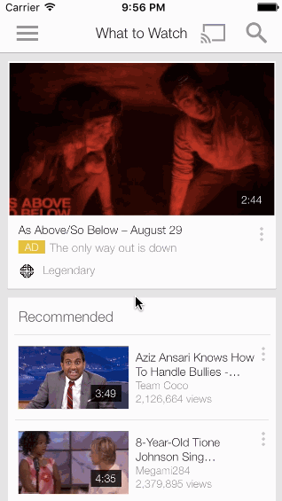

## YouTube Lab

Time spent: `2`

### Features

- Required features are implemented. 
- Tried to implement the AirBnB menu, but could not figure out how to access individual labels in the child menu view controller to animate them.

### Video Walkthrough 

Here's a walkthrough of implemented user stories:

GIF created with [LiceCap](http://www.cockos.com/licecap/).

## Notes

Describe any challenges encountered while building the app.

* Any libraries or borrowed content.
